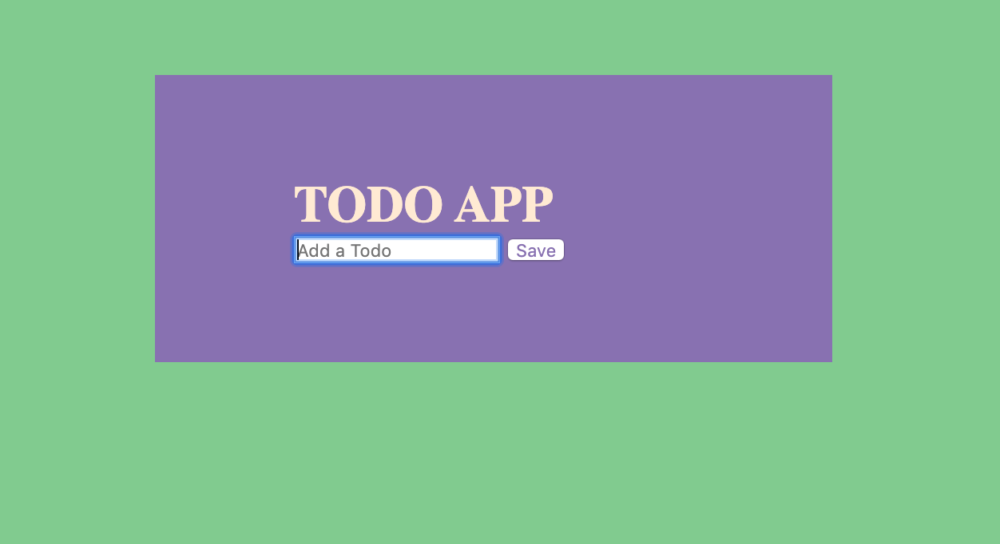

# To Do App

_A simple To Do application using vanilla javascript._

View live on CodePen <a href="https://codepen.io/marialobillo/pen/eYmYVgw" target="_blank">HERE</a>.

 

## Summary

To Do App is a single page application (SPA) that allows you to manage our tasks. The main objective of this project is to serve as a learning tool and familiarize myself with the Javascript programming language, take into account the functions offered by the browser and know the structure of a web application.

